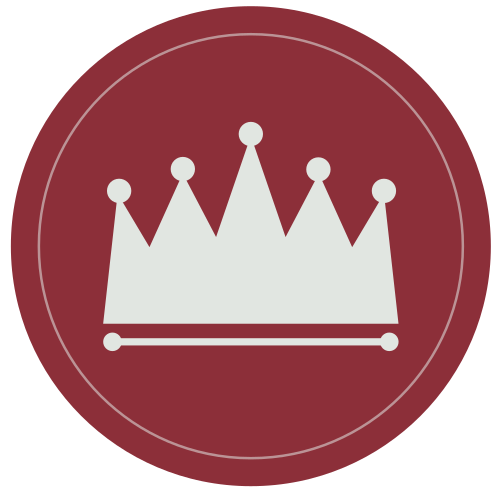

# La Taverne Royale - Site vitrine

Projet de création de site web réalisé dans le cadre de la **Mise en situation professionnelle**
du **Passe Numérique Pro 2026** (CNAM Paris / Le Garage Numérique / Thargo)
Période : 19 juin - 13 juillet 2026

**Groupe :** Lorenzo Loconsole, Moussa Bathily, Rafael Cohen
**Formateur :** Brice Laguerodie

---

## C'est quoi ce projet ?

On doit inventer un concept de restaurant et créer son site web vitrine complet.
Le restaurant s'appelle **La Taverne Royale**, une taverne française traditionnelle implantée dans le quartier Saint-François du Havre.

Le site est réalisé en **HTML/CSS avec Bootstrap**, le framework CSS utilisé tout au long de notre formation.

---

## Ce qu'il faut livrer

| Livrable | Outil | Responsable |
|---|---|---|
| Planche Identité (logo, couleurs, typo) | Figma / Canva | Moussa |
| Moodboard | Milanote | Rafael |
| Maquette Figma (Accueil + A la carte) | Figma | Lorenzo |
| **Site web HTML/CSS Bootstrap (4-5 pages)** | VS Code | Groupe |
| 2 posts Instagram fictifs | Canva / Figma | Moussa |
| Retro-planning | Word / Excel | Lorenzo |
| Rapport de projet individuel (PDF) | Word | Chacun |
| Diaporama de soutenance | PowerPoint | Groupe |

### Pages du site et répartition

| Fichier | Page | Responsable |
|---|---|---|
| `index.html` | Accueil | Rafael |
| `concept.html` | Concept | Lorenzo |
| `contact.html` | Contact | Moussa |
| `carte.html` | A la carte (section interactive) | Les trois |

> La page `carte.html` contient une section avec des boutons pour filtrer les entrées, plats et desserts. Les trois membres du groupe travaillent dessus, donc faites attention aux conflits sur ce fichier (voir règles plus bas).

---

## Organisation des dossiers

```
la-taverne-royale/
│
├── index.html          <- Page Accueil (Rafael)
├── concept.html        <- Page Concept (Lorenzo)
├── carte.html          <- Page A la carte (tous les trois)
├── contact.html        <- Page Contact (Moussa)
│
├── css/
│   ├── bootstrap.min.css    <- Bootstrap en local
│   └── style.css            <- Styles personnalisés (par-dessus Bootstrap)
│
├── js/
│   └── bootstrap.bundle.min.js  <- Bootstrap JS en local
│
├── images/             <- Toutes les images du site
│
└── assets/             <- Logo, icônes...
    └── fonts/          <- Polices en local (Pirata One, Roboto Condensed)
```

**Bootstrap est inclus en local** dans le dossier du projet. Les fichiers sont déjà dans le repo, tu les récupères automatiquement au `git clone`.

Dans le `<head>` de chaque page HTML :

```html
<link rel="stylesheet" href="css/bootstrap.min.css">
<link rel="stylesheet" href="css/style.css">
```

Et juste avant la fermeture de `</body>` :

```html
<script src="js/bootstrap.bundle.min.js"></script>
```

---

## Comment utiliser Bootstrap

Bootstrap est la bibliotheque qu'on as utilisé pendent les cours de CSS de M. ADJEDJOU. Elle nous fournit des classes CSS pretes a l'emploi.
tu ajoutes des `class="..."` sur tes balise HTML et Bootstrap s'occupe du style et de la mise en page.

Voici les classes qui suffisent pour ce projet.

### Le systeme de grille (mettre des elements en colonnes)

Bootstrap organise la page en lignes de 12 colonnes. C'est la base pour mettre deux blocs cote a cote :

```html
<div class="container">
  <div class="row">
    <div class="col-lg-6">Bloc de gauche (moitie de la largeur sur grand ecran)</div>
    <div class="col-lg-6">Bloc de droite</div>
  </div>
</div>
```

- `container` : centre le contenu et lui met des marges propres
- `row` : une ligne
- `col-lg-6` : une colonne qui prend 6/12 = la moitie de la ligne (sur ecran "large" `lg`, donc ordi). Sur mobile les colonnes passent automatiquement les unes sous les autres.
- Tu peux aussi faire 3 colonnes egales avec `col-lg-4` x3, ou 4 colonnes avec `col-lg-3` x4 (le total doit faire 12)

### Espacements (marges et paddings)

Pas besoin d'ecrire de CSS pour les espaces, Bootstrap a des classes toutes faites :

| Classe | Effet |
|---|---|
| `mt-3`, `mb-3`, `ms-3`, `me-3` | margin top / bottom / gauche (start) / droite (end), taille 3 |
| `mt-5` | encore plus d'espace (l'echelle va de 0 a 5) |
| `pt-4`, `pb-4` | padding top / bottom |
| `gap-3` | espace entre les elements d'un `row` ou d'un `d-flex` |
| `mx-auto` | centre un bloc horizontalement |

### Alignement et flexbox

```html
<div class="d-flex align-items-center justify-content-between gap-3">
  <div>Element 1</div>
  <div>Element 2</div>
</div>
```

- `d-flex` : met les enfants en ligne, cote a cote
- `align-items-center` : centre verticalement
- `justify-content-between` : pousse les elements aux deux extremites
- `text-center` : centre du texte dans un bloc

### Boutons, textes, couleurs de base

```html
<a href="contact.html" class="btn btn-primary">Un bouton Bootstrap classique</a>
<p class="text-center fs-5">Texte centre, taille 5</p>
```

Pour ce projet, on utilise plutot nos **propres boutons** definis dans `style.css` (voir charte graphique
plus bas), mais les classes Bootstrap `btn`, `text-center`, `fs-1` a `fs-6` (taille de texte), `fw-bold`
restent utiles pour le reste.

### Navbar (le menu en haut de page)

Le menu de navigation est deja code dans `concept.html`, copie-colle ce bloc tel quel dans tes pages
et change juste la classe `active` sur le lien de **ta** page :

```html
<nav class="navbar navbar-expand-lg navbar-taverne sticky-top py-0">
  <div class="container" style="height: 70px;">
    <a class="navbar-brand d-flex align-items-center gap-3" href="index.html">
      
      <span>
        <span class="d-block font-titre text-white fs-4 lh-1">La Taverne Royale</span>
        <span class="d-block sous-titre-nav">Cuisine Normande</span>
      </span>
    </a>
    <button class="navbar-toggler bg-white" type="button" data-bs-toggle="collapse" data-bs-target="#navMenu">
      <span class="navbar-toggler-icon"></span>
    </button>
    <div class="collapse navbar-collapse" id="navMenu">
      <ul class="navbar-nav ms-auto align-items-lg-center">
        <li class="nav-item"><a class="nav-link" href="index.html">Accueil</a></li>
        <li class="nav-item"><a class="nav-link" href="concept.html">Concept</a></li>
        <li class="nav-item"><a class="nav-link" href="carte.html">À la Carte</a></li>
        <li class="nav-item"><a class="nav-link" href="contact.html">Contact</a></li>
        <li class="nav-item ms-lg-3">
          <a class="btn-reserver d-inline-block" href="contact.html">Réserver</a>
        </li>
      </ul>
    </div>
  </div>
</nav>
```

> Mets la classe `active` sur le lien de la page ou tu es (regarde `concept.html` ligne par ligne pour
> voir comment c'est fait), et laisse les autres liens sans `active`.

### Footer (pied de page)

Meme logique : copie le footer de `concept.html` (en bas du fichier) dans tes pages, tu n'as rien a
inventer.

### Documentation complete de Bootstrap

[https://getbootstrap.com/docs/5.3/](https://getbootstrap.com/docs/5.3/)

---

## Charte graphique du site

Toutes les couleurs et polices du site sont definies une seule fois dans `css/style.css`, et reutilisees
partout grace a des classes. **Ne mets jamais de couleur "en dur" (`color: red`) dans tes pages** :
utilise toujours les classes/variables ci-dessous pour que le site reste coherent avec la fiche
identite du projet.

### Couleurs (palette officielle)

Quatre couleurs structurent l'identite. **Le bordeaux est la couleur principale ; le bleu est un simple
accent, a employer avec parcimonie** (uniquement navbar, footer, liens et elements interactifs).

| Nom | Code | Usage defini |
|---|---|---|
| Bordeaux (Stiletto) | `#8C2F39` | Couleur principale : en-tetes, titres-logo, fonds forts, boutons |
| Noir | `#000000` | Texte courant, contrastes, fonds inverses |
| Gris clair (Gray Nurse) | `#E1E6E1` | Fonds clairs, surfaces, respiration, texte sur fond sombre |
| Bleu (Matisse) | `#2176AE` | Accent : liens, navbar / pied de page, elements interactifs |

Ces couleurs sont disponibles en variables CSS dans `style.css`, a reutiliser dans tes pages plutot que
de retaper le code hexadecimal :

```css
var(--tr-bordeaux)   /* #8C2F39 */
var(--tr-noir)       /* #000000 */
var(--tr-gris-clair) /* #E1E6E1 */
var(--tr-bleu)       /* #2176AE */
```

> Pour des nuances de texte secondaire (legendes, labels), on n'invente pas de nouvelle couleur : on
> prend du Noir avec de la transparence, par exemple `color: rgba(0, 0, 0, .6);`. Une variable
> `--tr-bordeaux-hover` existe aussi dans `style.css` pour le survol des boutons (teinte calculee,
> elle ne fait pas partie de la fiche identite officielle).

### Polices

Les polices sont des fichiers `.woff2` stockes dans `assets/fonts/` et charges directement par
`style.css` via des regles `@font-face`. **Il n'y a rien a ajouter dans le `<head>` de tes pages** :
du moment que tu lies `css/style.css`, les polices sont disponibles partout.

- **Pirata One** (police "taverne medievale") pour tous les titres -> classe `font-titre`
- **Roboto Condensed** pour tout le texte courant -> appliquee par defaut sur `<body>`, rien a faire

Exemple d'un titre de section avec la bonne police et la bonne couleur :

```html
<h2 class="font-titre titre-section">Mon titre de section</h2>
```

### Classes "maison" disponibles (definies dans style.css)

Pas besoin de les recreer, elles existent deja et font deja le bon rendu :

| Classe | A quoi ca sert |
|---|---|
| `.bandeau-deco` | Le bandeau rayé bordeaux tout en haut de chaque page |
| `.navbar-taverne` | Style de la navbar bleue (accent) |
| `.btn-reserver` | Bouton bordeaux "Réserver" (navbar, footer, sections) |
| `.hero-page` / `.hero-overlay` | Grande image en haut de page avec overlay bordeaux et titre |
| `.section-claire` | Section avec fond gris clair et padding standard |
| `.titre-section` | Titre `h2` bordeaux en Pirata One |
| `.banniere-image` / `.banniere-overlay` | Bandeau image pleine largeur avec overlay bordeaux |
| `.footer-taverne` | Style du footer bleu (accent) |

**Regarde `concept.html` comme exemple de reference** : toutes ces classes y sont utilisees dans leur
contexte. Le plus simple pour creer une nouvelle page, c'est de copier la structure de `concept.html`
(navbar + footer identiques) et de remplacer seulement le contenu du milieu.

### Convention des liens (`href`)

Utilise toujours ces noms de fichiers exacts pour les liens entre pages, meme si la page n'existe pas
encore chez toi (un camarade la creera) :

| Lien vers | `href` a utiliser |
|---|---|
| Accueil | `index.html` |
| Concept | `concept.html` |
| A la carte | `carte.html` |
| Contact | `contact.html` |

---

## Installer les outils (a faire une seule fois)

### 1. Installer Git

Git est le logiciel qui permet de synchroniser votre travail entre vous.

**Windows**
1. Va sur [https://git-scm.com/download/win](https://git-scm.com/download/win)
2. Télécharge et installe (laisse toutes les options par défaut, clique juste "Next")
3. Une fois installé, ouvre **Git Bash** (cherche-le dans le menu Démarrer)

**macOS**
1. Ouvre le **Terminal** (cherche "Terminal" dans Spotlight avec `Cmd + Espace`)
2. Tape cette commande et appuie sur Entree :
```
git --version
```
3. Si Git n'est pas installé, macOS te propose automatiquement de l'installer, accepte

**Linux (Ubuntu/Debian)**
1. Ouvre le **Terminal**
2. Tape :
```
sudo apt install git
```

---

### 2. Installer VS Code

L'éditeur de code recommandé pour ce projet.
[https://code.visualstudio.com](https://code.visualstudio.com)

Télécharge la version pour ton système et installe normalement.

---

### 3. Configurer Git avec ton identité (a faire une seule fois)

Ouvre Git Bash (Windows) ou Terminal (Mac/Linux) et tape ces deux commandes
en remplaçant par ton prénom/nom et ton email GitHub :

```bash
git config --global user.name "Ton Prénom Nom"
git config --global user.email "ton@email.com"
```

> **Important :** mets exactement l'email avec lequel tu es inscrit sur GitHub (visible et
> verifie sur [github.com/settings/emails](https://github.com/settings/emails)). Si tu mets un
> autre email, GitHub n'arrivera pas a relier tes commits a ton compte, et tu ne pourras pas
> avoir le badge "Verified" (voir section suivante).

---

### 4. (Optionnel) Verifier tes commits

Par defaut, tes commits affichent juste ton nom en texte (n'importe qui peut taper ce nom dans
sa config Git, donc ca ne prouve rien). Le badge vert **"Verified"** sur GitHub prouve en plus,
de facon cryptographique, que c'est bien toi qui as ecrit le commit. Voila comment l'activer.

**1. Verifie que tu as une cle SSH**, ou genere-en une dediee a la signature si tu n'en as pas :

```bash
ls ~/.ssh/id_ed25519.pub
```

Si la commande dit que le fichier n'existe pas, genere une nouvelle cle :

```bash
ssh-keygen -t ed25519 -C "ton@email.com"
```
(laisse tout par defaut, appuie sur Entree a chaque question)

**2. Configure Git pour signer tes commits avec cette cle :**

```bash
git config --global gpg.format ssh
git config --global user.signingkey ~/.ssh/id_ed25519.pub
git config --global commit.gpgsign true
```

**3. Recupere ta cle publique et copie-la :**

```bash
cat ~/.ssh/id_ed25519.pub
```

**4. Ajoute-la sur GitHub :**
1. Va sur [github.com/settings/keys](https://github.com/settings/keys)
2. Clique **"New SSH key"**
3. Choisis bien **Key type : "Signing Key"** (pas "Authentication Key", sinon ca ne marchera pas)
4. Colle ta cle publique et clique **"Add SSH key"**

A partir de maintenant, tous tes nouveaux commits afficheront le badge **"Verified"** sur GitHub.

---

## Récupérer le projet sur ton ordinateur

Cette étape s'appelle **cloner** le dépôt. Tu n'as à le faire **qu'une seule fois**.

1. Ouvre Git Bash (Windows) ou Terminal (Mac/Linux)
2. Va dans le dossier où tu veux mettre le projet, par exemple sur le Bureau :
```bash
cd Desktop
```
3. Clone le projet :
```bash
git clone https://github.com/suntan6z/la-taverne-royale.git
```
4. Entre dans le dossier créé :
```bash
cd la-taverne-royale
```

Tu peux maintenant ouvrir ce dossier dans VS Code.

---

## Travailler au quotidien - les 3 commandes a retenir

A chaque fois que tu t'installes pour travailler, suis ces étapes dans l'ordre.

### Etape 1 - Récupérer le travail des autres (TOUJOURS en premier !)
```bash
git pull
```
> Ne jamais oublier cette commande avant de commencer a coder. Sinon tu risques des conflits.

### Etape 2 - Tu travailles, tu modifies tes fichiers...

### Etape 3 - Envoyer ton travail (quand tu as fini ta session)
```bash
git add .
git commit -m "Description de ce que tu as fait"
git push
```

**Exemples de messages de commit clairs :**
- `"Ajout de la structure HTML de la page contact"`
- `"Mise en page du menu dans carte.html"`
- `"Correction des couleurs du header"`

---

## Règle d'or pour éviter les conflits

**Chacun travaille sur ses propres fichiers.**
Si deux personnes modifient le même fichier en même temps, Git ne sait plus quelle version garder.

Pour `carte.html` qui est partagée entre les trois, communiquez avant de vous y mettre : décidez qui travaille dessus a quel moment, et prévenez les autres sur Matrix quand vous avez fini et pushé.

---

## En cas de problème

**"J'ai un message d'erreur quand je fais `git push`"**
Tu as peut-être oublié le `git pull` avant. Fais-le maintenant et recommence.

**"Je ne sais pas si mon push a marché"**
Va sur [github.com/suntan6z/la-taverne-royale](https://github.com/suntan6z/la-taverne-royale) et vérifie si tes fichiers sont bien là.

**"J'ai cassé quelque chose"**
Pas de panique, Git garde tout l'historique. Contacte Lorenzo ou demande a Brice.

---

## Dates importantes

| Date | Echeance |
|---|---|
| 10/07/2026 | Rendu du rapport individuel (PDF par mail) |
| 13/07/2026 | Soutenance orale |

---

*Projet réalisé dans le cadre du Passe Numérique Pro 2026 - CNAM Paris*
